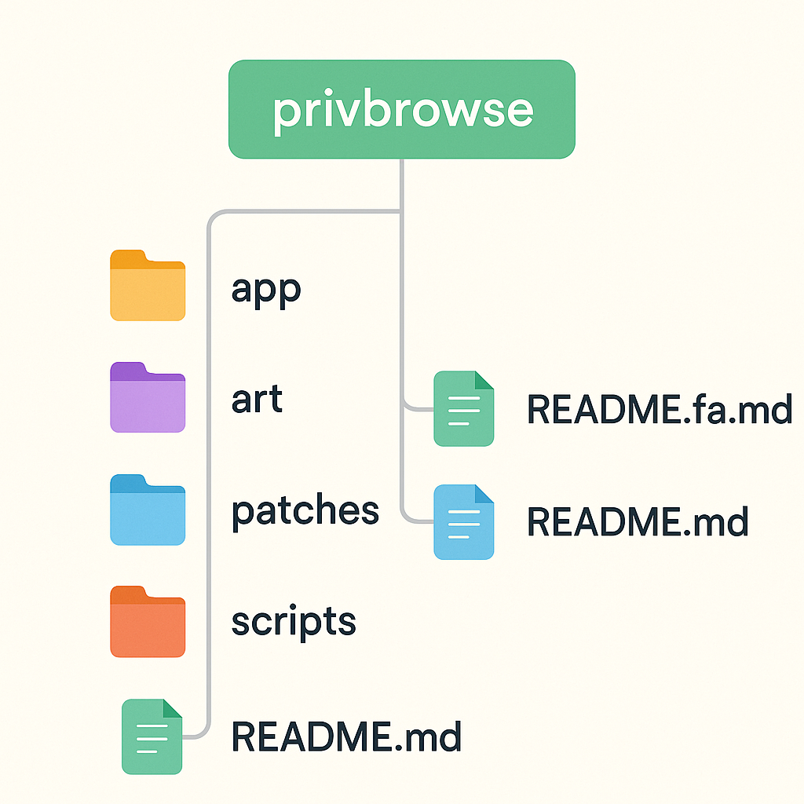

# مرورگر PrivBrowse

**PrivBrowse** یک مرورگر اندرویدی مبتنی بر کرومیوم و فورکی از [Cromite](https://github.com/uazo/cromite) است، با تمرکز بر حفظ حریم خصوصی، پشتیبانی قدرتمند از پروکسی، و شخصی‌سازی بالا برای کاربران در کشورهای محدودشده.

## امکانات اصلی (در دست توسعه)

- 🔐 تنظیمات حریم خصوصی ساده‌تر و کاربرپسند
- 🌐 مدیریت یوزر‌ایجنت:
  - استفاده از یوزر‌ایجنت‌های پیش‌فرض در حال حاضر (۱۰ دسکتاپ + ۱۰ موبایل پرکاربرد) [متغییر با پیشنهادات]
  - یا قرار دادن یوزر‌ایجنت شخصی (مثل کرومیت)
- 🧩 پشتیبانی از اجرای اسکریپت‌های کاربر (در منوی اصلی)
- 🕑 تغییر منطقه زمانی (درحال‌حاضر عملکرد مناسبی دارد)
- ⬇️ افزودن گزینه استفاده از دانلودر دلخواه
- 💡 حذف گزینه‌های اضافی و رابط تمیزتر
- 🚀 پشتیبانی کامل از انواع پروکسی‌ها (PAC، HTTP، SOCKS و ...)
  - تمرکز بر پروکسی‌های **رایگان و در دسترس**
  - بهینه‌سازی برای کشورهایی که تحریم یا از اینترنت آزاد کم‌برخوردار هستند!

## برنامه‌های آینده

- بهینه‌سازی برای اندروید ۸ به بالا
- کم‌حجم‌سازی نسخه نهایی APK
- پشتیبانی بهتر از زبان‌ها و فونت فارسی
- اسکریپت‌های خودکار تنظیم پروکسی

## ساختار پروژه

---

### 📄 خواندن نسخه‌ی [انگلیسی](README.md)

---
### 🙌 قدردانی از مشارکت‌کنندگان

با احترام کامل به مشارکت‌کنندگان upstream، این پروژه صرفاً بهینه‌سازی برای سهولت و دسترسی بهتر کاربران در شرایط خاص است.

---
